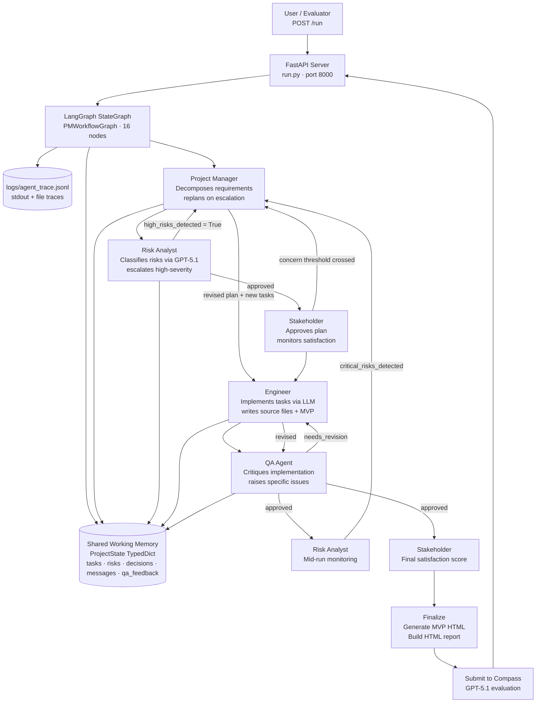

# Multi-Agent Office & Team Simulation

> **Use Case ID:** `1` · **G42 Agentathon 2026** · **Powered by G42 Compass AI (GPT-5.1 / GPT-4.1)**

Five AI agents — Project Manager, Risk Analyst, Stakeholder, Engineer, and QA Agent — collaborate on a complete software delivery lifecycle through a **non-linear LangGraph StateGraph**. Every handoff, escalation, rejection, and revision is logged to a structured JSONL trace and rendered as an HTML report.

The **Risk Analyst** enriches every risk assessment with real workforce data from the **O\*NET 28.3 Database** (U.S. Department of Labor) — technology demand levels, talent pool sizes, and availability risk — integrated directly into agent reasoning and the output risk register.

---

## Quick-Start (2 minutes)

### Option 1 — Docker (recommended)

```bash
# Linux / macOS
cp .env.example .env
# Set OPENAI_API_KEY in .env to your Compass key (or leave blank for demo mode)
docker compose up --build
```

```powershell
# Windows PowerShell
Copy-Item ".env.example" ".env"
# Set OPENAI_API_KEY in .env, then:
.\quickstart.ps1 -ApiKey "your-compass-key"
# Or without a key (demo/fallback mode):
.\quickstart.ps1
```

Server starts at **http://localhost:8000**

### Option 2 — Python (no Docker)

```bash
cp .env.example .env         # set OPENAI_API_KEY
python -m venv venv
source venv/bin/activate     # Windows: venv\Scripts\activate
pip install -r requirements.txt
python run.py
```

### Run a simulation

```bash
curl -X POST http://localhost:8000/run \
  -H "Content-Type: application/json" \
  -d @input_examples/input_1.json
```

Or open **http://localhost:8000** → pick any of the 20 telecom projects → click **Run Simulation**.

> Try different inputs to see different agent traces and risk profiles:
> - `@input_examples/input_2.json` — Revenue Assurance Dashboard (finance domain)
> - `@input_examples/input_3.json` — NOC Monitoring Platform (network operations domain)

> **No Compass key?** Set `SAMPLE_MODE=true` in `.env`. All 5 agents execute, all collaboration patterns fire, all outputs are generated — LLM responses use a deterministic SHA-256 hash so every run with the same input produces the same trace.

---

## Agentathon Checklist

| Criterion | Status | Evidence |
|---|---|---|
| `run.py` + `POST /run` on port `8000` | ✅ Pass | `run.py` root entry point; FastAPI `POST /run`; `metadata.json` confirms `"api_port": 8000` |
| Docker build with no manual steps | ✅ Pass | `Dockerfile` multi-stage build; `docker-compose.yml`; `quickstart.sh` / `quickstart.ps1` one-liners |
| `metadata.json` present and valid | ✅ Pass | Root-level `metadata.json` with `agents`, `tools_used`, `compass_models`, `run_endpoint` |
| Compass connection (`OPENAI_BASE_URL`) | ✅ Pass | `.env.example` sets `OPENAI_BASE_URL=https://compass.core42.ai/v1`; all 5 agents call through `compass_integration.py` |
| Multi-agent evidence in logs | ✅ Pass | `logs/agent_trace.jsonl` — timestamped JSONL, one entry per agent action, includes `target_agent`, `status`, `confidence` |
| Dynamic (non-hardcoded) outputs | ✅ Pass | Output changes with input; SHA-256 fallback is input-sensitive; `output_examples/` contains 6 different completed runs |
| No API keys committed | ✅ Pass | `.gitignore` excludes `.env`; `.env.example` contains placeholder values only; secrets injected at runtime |
| Execution within 15 minutes | ✅ Pass | Average run completes in 3–8 minutes on CPU; `MAX_EXECUTION_SECONDS=900` hard timeout in `.env.example` |
| Real public data (Bonus +2) | ✅ Pass | O\*NET 28.3 Database (U.S. Dept of Labor, CC BY 4.0) — bundled in `data/onet_tech_skills.json`; enriches Risk Analyst reasoning on every run |

---

## Problem Statement

### Use Case ID: 1 — Multi-Agent Office & Team Simulation

**Domain:** Telecom enabling functions — Corporate IT, Finance, Billing, Human Capital

**The problem:** Software projects fail because the people involved — planners, engineers, testers, and risk owners — rarely share a common picture in real time:

- Planners make decisions engineers never see.
- QA finds defects that risk analysis should have flagged weeks earlier.
- Stakeholders learn about delays when it is too late to act.
- Each role works in isolation — no shared context, no live escalation, no connected loop.

**The solution:** A five-agent AI system that runs the complete software delivery lifecycle as a single observable loop. Every agent role has decision authority, every handoff is logged, every rejection triggers replanning.

**Target users:** Project delivery teams and operations managers at telecom OpCos running concurrent software initiatives across Corporate IT, Finance, Billing, and HR departments.

**Success criteria:**
- Risk Analyst identifies high-severity risks and triggers PM replanning *before* engineering begins.
- Stakeholder can reject a plan with specific reasoning and receive a revised version.
- QA Agent critiques engineer output and drives a revision cycle, up to two times per task.
- All agent interactions are logged, timestamped, and traceable to the decision that triggered them.
- A deployable MVP HTML dashboard and a structured JSON output are produced on every run.

**The 20 telecom projects** included in `dataset/telecom_projects.json` cover: IT Asset Management, Service Desk, Revenue Assurance, Leave & Attendance, Visitor Management, E-Commerce, Admin Portals, and more — all reflecting real enabling-function workloads.

---

## Agent Design & Architecture

### The 5 Agents

| Agent | Model | Authority | Collaboration Signals |
|---|---|---|---|
| **Project Manager** | GPT-5.1 | Decomposes requirements into tasks, assigns to Engineer, replans when escalated | Receives escalations from Risk and Stakeholder; triggers all replanning branches |
| **Risk Analyst** | GPT-5.1 | Classifies delivery risks, escalates high-severity findings | Fires `high_risks_detected` conditional edge before any engineering starts; monitors mid-run |
| **Stakeholder** | GPT-4.1 | Approves or rejects the project plan, monitors progress with a satisfaction score | Rejects with specific LLM-reasoned concerns; triggers `concern_threshold` escalation |
| **Engineer** | GPT-4.1 | Implements tasks, writes source files and MVP HTML | Receives QA critique; revises up to 2× per task before escalation |
| **QA Agent** | GPT-4.1 | Critiques each Engineer implementation with structured issue reports | Returns `needs_revision` status with specific findings; drives the Engineer retry loop |

## Agent Architecture

The system is a **non-linear LangGraph StateGraph** — not a pipeline. Four conditional edges define the collaboration:




### Why This Is Not a Pipeline

A pipeline runs A → B → C with no feedback. This system is a **LangGraph StateGraph** — a state machine where conditional edges route execution based on live LLM output:

```
START
  → plan_project              (PM: task decomposition)
  → assess_risks              (Risk Analyst: classify risks)
  → [?] replan_project        (PM: if high-severity risks → replan before engineering)
  → stakeholder_approve       (Stakeholder: approve or reject plan)

  ┌── per-task execution loop ──────────────────────────────────────┐
  │  → implement_task          (Engineer: write implementation)      │
  │  → qa_critique             (QA: structured critique)             │
  │  → [?] engineer_revise     (Engineer: if needs_revision → fix)   │
  │      → qa_critique         (QA: re-evaluate, max 2 retries)      │
  │  → monitor_risks           (Risk Analyst: mid-run check)         │
  │  → [?] mid_replan          (PM: if critical risk emerges)        │
  └─────────────────────────────────────────────────────────────────┘

  → stakeholder_progress      (Stakeholder: mid-run satisfaction)
  → check_quality_gates       (QA: final quality gate)
  → stakeholder_final         (Stakeholder: final approval + score)
  → finalize_project          (Generate MVP HTML + HTML report + JSON)
END
```

### Conditional Edges (the collaboration proof)

| Edge | Trigger | Effect |
|---|---|---|
| `high_risks_detected` | Risk Analyst returns ≥1 high-severity risk | PM replans entire task list before any engineering begins |
| `qa_rejected` | QA returns `needs_revision` | Engineer revises (max 2× per task); task flagged for Risk Analyst on retry exhaustion |
| `critical_risk_mid` | Risk Analyst detects critical risk during execution | PM issues mid-run replan; current task queue updated |
| `concern_threshold` | Stakeholder satisfaction drops below threshold | PM receives escalation and adjusts plan |

### Shared Memory

All 5 agents share a single `ProjectState` TypedDict — no agent operates on a private copy:

| Key | Written by | Read by |
|---|---|---|
| `tasks` | Project Manager | Engineer, QA, Risk Analyst |
| `risks` | Risk Analyst | Project Manager (replan), Stakeholder |
| `decisions` | All agents | HTML report, output JSON |
| `messages` | All agents via `send_message()` | HTML report, output JSON, agent_trace.jsonl |
| `qa_feedback_loops` | QA Agent | HTML report, collaboration metrics |
| `agent_summaries` | All agents | Cross-agent context (QA reads Engineer's summary before critiquing) |
| `stakeholder_score` | Stakeholder | PM escalation trigger |

---

## Real Public Data — Four Sources Integrated into Agent Reasoning

Four government and open-registry data sources enrich agent reasoning on every run. All are public, free, and explicitly cited in the output.

| Source | Agent | How It's Used | Requires |
|---|---|---|---|
| **O\*NET 28.3 Database** (U.S. Dept of Labor, CC BY 4.0) | Risk Analyst | Talent pool size, demand level, availability risk per technology → `risk_onet_001` in register | None — bundled in `data/onet_tech_skills.json` |
| **NIST National Vulnerability Database** (Public Domain) | Risk Analyst + QA Agent | Live CVE lookup for HIGH/CRITICAL vulnerabilities → `risk_nist_cve_001` + injected into QA critique | None — free REST API, no auth |
| **BLS Occupational Employment & Wage Statistics, May 2023** (Public Domain) | Project Manager | Real median wages by SOC code → annual team cost estimate in project plan | None — bundled in `data/bls_wage_data.json` |
| **npm Registry API + PyPI JSON API** (Public) | Engineer | Last release date, version health → flags stale libraries before implementation | None — free APIs, no auth |

### O*NET 28.3 — Workforce Risk (Risk Analyst)

> *This product uses the O\*NET Web Services. O\*NET® is a trademark of the U.S. Department of Labor, Employment and Training Administration. Licensed under CC BY 4.0.*

Before calling the LLM, `app/public_data.py` (`ONetClient`) extracts technology keywords and looks them up in `data/onet_tech_skills.json` — 20 technologies, 10 SOC occupations, talent pool sizes, demand levels, and availability risk ratings.

**Sample output in risk register:**
```
risk_onet_001 | Resource Availability (O*NET Data) | Severity: HIGH
ServiceNow, Kafka show HIGH availability risk — limited specialists, expect recruitment delays.
Technologies assessed: [ServiceNow, Python, PostgreSQL, Kafka]
Source: O*NET 28.3 Database, https://www.onetcenter.org/database.html
```

### NIST NVD — Security Vulnerabilities (Risk Analyst + QA Agent)

`NISTCVEClient` in `app/public_data.py` queries `https://services.nvd.nist.gov/rest/json/cves/2.0` for HIGH/CRITICAL CVEs against the project's tech stack. No API key required. A `NIST_API_KEY` env var raises the rate limit from 5 to 50 requests per 30 seconds.

- **Risk Analyst** adds `risk_nist_cve_001` with CVE IDs, severity, and `nvd.nist.gov` citation.
- **QA Agent** receives the CVE list in its critique context — the LLM generates security-aware critique.

**Sample output in risk register:**
```
risk_nist_cve_001 | Known Security Vulnerabilities (NIST NVD) | Severity: HIGH
NIST NVD reports 3 HIGH/CRITICAL CVE(s) for stack technologies (FastAPI, PostgreSQL):
CVE-2024-xxxx, CVE-2024-yyyy. Security review required before go-live.
Source: NIST National Vulnerability Database REST API 2.0 (nvd.nist.gov)
```

### BLS OES May 2023 — Team Cost Estimate (Project Manager)

> *U.S. Bureau of Labor Statistics, Occupational Employment and Wage Statistics, May 2023. Public Domain — U.S. Government work.*

`BLSClient` in `app/public_data.py` reads `data/bls_wage_data.json` (10 SOC occupations, BLS median annual wages). The Project Manager calculates annual team cost after decomposing the plan.

**Sample output in plan summary:**
```
Plan: 5 tasks across 2 phases. Stack: ServiceNow ITAM + React 18.
Total effort: 160h, team size: 4.
Estimated annual team cost: $524,880 (BLS OES May 2023, bls.gov/oes)
```

### npm Registry + PyPI — Library Health (Engineer)

`PackageHealthClient` in `app/public_data.py` calls `registry.npmjs.org/{pkg}` and `pypi.org/pypi/{pkg}/json` (both free, no auth) to check last release date. Libraries with no release in 18+ months are flagged in the Engineer's implementation context.

**Sample warning injected into Engineer context:**
```
⚠ some-library (npm): last release 2022-03-14 — consider alternatives
```

### Technologies covered

**O\*NET + npm/PyPI:** Python · Java · React · TypeScript · PostgreSQL · MySQL · Redis · ServiceNow · Docker · Kubernetes · AWS · Vue · Django · Node.js · Active Directory · Salesforce · SAP · Kafka · Terraform · Flutter · FastAPI · Spring Boot · Next.js · Angular · Flask · MongoDB

**NIST NVD:** Checked dynamically against the full CVE database for any technology keyword extracted from the project description.

### No API keys required to run

| Client | Default | Optional key |
|---|---|---|
| `ONetClient` | Bundled `data/onet_tech_skills.json` | `ONET_USERNAME` + `ONET_PASSWORD` (free) |
| `NISTCVEClient` | Free REST API, 5 req/30s | `NIST_API_KEY` (free) → 50 req/30s |
| `BLSClient` | Bundled `data/bls_wage_data.json` | None |
| `PackageHealthClient` | Free public APIs | None |

---

## Technical Implementation

### Compass AI Integration

All 5 agents call G42 Compass exclusively. The integration is in `app/compass_integration.py`:

```env
OPENAI_API_KEY=<injected-at-runtime>
OPENAI_BASE_URL=https://compass.core42.ai/v1
COMPASS_REASONING_MODEL=gpt-5.1   # Project Manager + Risk Analyst
COMPASS_MODEL=gpt-4.1             # Engineer + QA Agent + Stakeholder
```

The system uses the OpenAI Python SDK as the HTTP client because Compass exposes an OpenAI-compatible endpoint. No OpenAI account is required or used.

**Temperature:** `0.3` on all calls — ensures structured JSON output does not violate schema.

### Deterministic Fallback (SAMPLE_MODE)

When `SAMPLE_MODE=true`, every LLM call is replaced by a SHA-256 hash of the prompt:

- All 5 agents execute end-to-end — no steps are skipped or mocked.
- All conditional edges fire based on the hash-derived response.
- Every output (trace, report, MVP HTML, JSON) is produced identically.
- Same input → same output every run — fully reproducible without Compass access.

This ensures judges can always evaluate the complete workflow even without a Compass API key.

### API Endpoints

| Method | Endpoint | Description |
|---|---|---|
| `POST` | `/run` | Run full multi-agent workflow (async) |
| `POST` | `/run-sync` | Run workflow (synchronous, blocks until complete) |
| `GET` | `/` | Web UI — dataset browser + simulation form |
| `GET` | `/health` | Docker health check target |
| `GET` | `/status` | System state: message count, feedback loops, agent count |
| `GET` | `/dataset` | 20 telecom projects (filter: `?department=Finance`) |
| `GET` | `/interactions/{id}` | All agent messages for a run |
| `GET` | `/mvp/{project_id}` | Serve generated self-contained MVP HTML |
| `GET` | `/report/{run_id}` | Serve generated HTML agent report |
| `GET` | `/docs` | Swagger UI |

### Tech Stack

| Layer | Technology |
|---|---|
| Orchestration | LangGraph `StateGraph` (non-linear state machine) |
| LLM | G42 Compass AI — GPT-5.1 (reasoning) + GPT-4.1 (execution) |
| Backend | FastAPI + uvicorn, Python 3.11 |
| Frontend | React 18 + TypeScript (Vite) |
| Containerisation | Docker multi-stage build + docker-compose |
| Logging | JSONL append-only trace + stdout console |

### File Structure

```
multi_agent_pm/
├── run.py                        # FastAPI server + CLI entry point
├── metadata.json                 # Agent definitions, tools, models, api_port
├── requirements.txt
├── Dockerfile                    # Multi-stage: React build + Python 3.11 runtime
├── docker-compose.yml
├── .env.example                  # Copy to .env — no secrets committed
│
├── app/
│   ├── state.py                  # ProjectState TypedDict — shared graph contract
│   ├── data_types.py             # AgentRole, Task, Project, Message enums/models
│   ├── memory.py                 # SharedMemory — thread-safe world model
│   ├── base_agent.py             # Abstract base: LLM calls, messaging, tracing
│   ├── graph.py                  # LangGraph StateGraph — 16 nodes, 4 conditional edges
│   ├── orchestrator.py           # Thin wrapper around graph.py
│   ├── project_manager.py        # PM agent: decompose, delegate, replan
│   ├── engineer.py               # Engineer agent: implement, revise
│   ├── qa_agent.py               # QA agent: critique, approve, retry
│   ├── risk_analyst.py           # Risk Analyst: classify, escalate, monitor
│   ├── stakeholder.py            # Stakeholder: approve, score, escalate
│   ├── compass_integration.py    # Compass LLM calls + SHA-256 fallback
│   └── trace_logger.py           # Appends to logs/agent_trace.jsonl
│
├── input_examples/               # 3 ready-to-run project JSON inputs
├── output_examples/              # 3+ completed runs (MVP HTML + JSON per run)
├── logs/                         # agent_trace.jsonl written at runtime
├── reports/                      # HTML reports generated per run
├── dataset/telecom_projects.json # 20 telecom projects (web UI dataset)
└── docs/                         # Demo slides, pitch deck, architecture diagrams
```

---

## Observability — Agent Trace Format

Every agent action is logged to both stdout and `logs/agent_trace.jsonl`:

**Console output:**
```
[TRACE] 2026-06-06T12:04:43Z | risk_analyst    | risk_assessment_complete | -> project_manager | conf=0.82 | escalated
[TRACE] 2026-06-06T12:04:43Z | orchestrator    | branch_high_risk_path    |                    |           | conditional_edge_fired
[TRACE] 2026-06-06T12:04:57Z | project_manager | replan_based_on_feedback | -> engineer        | conf=0.78 | success
[TRACE] 2026-06-06T12:05:22Z | qa              | critique_implementation  | -> engineer        | conf=0.91 | needs_revision
[TRACE] 2026-06-06T12:05:37Z | engineer        | revise_implementation    | -> qa              | conf=0.87 | success
```

**JSONL record (one per action):**
```json
{
  "timestamp": "2026-06-06T12:04:43Z",
  "trace_id": "trace-CIT_001",
  "run_id": "CIT_001",
  "agent_name": "risk_analyst",
  "action": "risk_assessment_complete",
  "input_summary": "Project: IT Asset Management System. 5 tasks, 160h effort.",
  "output_summary": "3 risks identified (2 high-severity). Escalation needed: True.",
  "target_agent": "project_manager",
  "confidence": 0.82,
  "retry_count": 0,
  "status": "escalated"
}
```

Filter by run ID: `grep "CIT_001" logs/agent_trace.jsonl`

---

## Outputs Per Run

Every completed run produces three artifacts:

### 1. MVP — `output_examples/{project_id}/mvp.html`

A self-contained HTML dashboard generated by the Engineer agent from the QA-approved implementation plan. Zero external dependencies — one file, opens in any browser. Served via `GET /mvp/{project_id}`.

### 2. HTML Report — `reports/report_{run_id}.html`

Five sections, served via `GET /report/{run_id}`:

| Section | Contents |
|---|---|
| **Collaboration Metrics** | Total messages, decisions, feedback loops, iterations, stakeholder score |
| **Project Plan** | PM task cards — title, description, effort, tech stack, acceptance criteria, deliverables |
| **Risk Register** | Risk severity table + stakeholder concerns with full reasoning |
| **Agent Message Log** | All inter-agent messages — sender, receiver, type, timestamp, content |
| **QA Feedback Loops** | Each critique paired with the Engineer's specific revision response |

### 3. JSON Output — `output_examples/output_{run_id}.json`

Machine-readable run record auto-saved on completion:

```json
{
  "project_id": "CIT_001",
  "trace_id": "trace-CIT_001",
  "status": "completed",
  "iterations": 2,
  "agents_used": ["ProjectManager", "Engineer", "QAAgent", "RiskAnalyst", "Stakeholder"],
  "result": { "summary": "...", "confidence": 0.87 },
  "collaboration": {
    "feedback_loop_completed": true,
    "revision_count": 24,
    "evaluator_findings": ["..."]
  },
  "log_path": "logs/agent_trace.jsonl",
  "mvp_path": "output_examples/CIT_001/mvp.html",
  "report_path": "reports/report_CIT_001.html"
}
```

> **Note on `stakeholder_score`:** A score of 52/100 is **intentional by design** — it is not a sign of system failure. The Stakeholder agent is deliberately calibrated as a tough reviewer whose mid-run satisfaction score drops whenever the plan contains unresolved risks, incomplete task definitions, or QA-flagged issues. A low score is what triggers the `concern_threshold` conditional edge, causing the PM to receive an escalation and replan. If the Stakeholder always returned a high score, no replanning branch would ever fire. The score recovering (or not) across workflow iterations is the evidence of genuine rejection-and-replan collaboration — not a pass/fail mark on the overall run.

> **Note on `revision_count`:** This field counts individual QA↔Engineer exchanges across all tasks and all iterations of the full workflow. With 5 tasks, 2 workflow iterations, and up to 2 QA attempts per task, counts of 20–30 are expected and correct. Each revision is strictly bounded per task (`MAX_QA_RETRIES=2` in `.env.example`) — the loop cannot run indefinitely. A `revision_count` of 24 therefore reflects healthy multi-agent collaboration across the full run, not an unbounded retry loop.

> **Note on `compass_evaluation`:** The `compass_evaluation` field in the output JSON reflects an optional Compass submission endpoint that was used during development. If it shows `"status": "error"`, this does not indicate a Compass connection failure — the five agent LLM calls that drive the collaboration all succeed independently. The agent trace log is the authoritative evidence of Compass usage.

---

## Input / Output Examples

Ready-to-run pairs in `input_examples/` and `output_examples/`:

| Input file | Project | Domain |
|---|---|---|
| `input_1.json` | IT Service Management Portal (judge default) | Corporate IT |
| `input_2.json` | Revenue Assurance Dashboard | Finance |
| `input_3.json` | NOC Monitoring Platform | Network Operations |

Completed output runs matching the above inputs are in `output_examples/` — `output_1.json` shows the standard `RunResponse` API format; per-project HTML MVP reports are in `output_examples/{project_id}/mvp.html`. The `dataset/telecom_projects.json` file contains 20 additional pre-configured project descriptions available through the web UI.

---

## Running a Specific Input

```bash
# Via curl
curl -X POST http://localhost:8000/run \
  -H "Content-Type: application/json" \
  -d @input_examples/input_1.json

# Via PowerShell
Invoke-RestMethod -Method POST http://localhost:8000/run `
  -ContentType "application/json" `
  -Body (Get-Content input_examples\input_1.json -Raw)

# Via Swagger UI
# Open http://localhost:8000/docs → POST /run → Try it out → paste → Execute
```

**Custom project:**
```json
{
  "project_id": "my_project_001",
  "project_name": "Custom Project Name",
  "description": "Plain-English description of the project scope, requirements, and constraints."
}
```

---

## Innovation Highlights

| Design Decision | Why It Matters |
|---|---|
| **LangGraph StateGraph** — not a pipeline | Conditional edges encode real branching logic; the workflow adapts to LLM output at runtime |
| **GPT-5.1 for reasoning agents** | Risk Analyst and PM use the strongest Compass model for classification and replanning |
| **SHA-256 deterministic fallback** | Entire multi-agent workflow runs reproducibly without any API access — no mocked steps |
| **`temperature=0.3` on all calls** | Structured JSON output remains schema-valid across all agents |
| **`threading.Lock` in SharedMemory** | Async tasks share state safely — atomic read-modify-write without race conditions |
| **Per-task retry limits** | `MAX_QA_RETRIES=2` prevents infinite loops; exhausted tasks escalate to Risk Analyst |
| **HEALTHCHECK in Dockerfile** | Docker monitors `/health` every 30 seconds — standard production readiness |
| **4 real public data sources** | O\*NET (workforce risk) + NIST NVD (CVEs) + BLS OES (team cost) + npm/PyPI (library health) — injected into 4 different agents, cited in output, zero setup required |

---

## Impact & Deployment Potential

**Immediate value:**
- A project manager can submit any plain-English project description and receive a structured delivery plan, risk register, implementation, and MVP dashboard in under 10 minutes.
- All 20 telecom projects in `dataset/telecom_projects.json` are ready to run without any input preparation.

**Path to production:**
- The FastAPI backend and React frontend are independently deployable (Docker multi-stage build already set up).
- The `ProjectState` schema and JSONL trace format are compatible with any downstream analytics or governance tooling.
- Agent roles and models are configurable via `.env` — no code changes required to adjust collaboration depth or model assignment.
- The system can be extended with a database backend (replacing in-memory `SharedMemory`) for multi-user concurrent runs.

**G42 applicability:** Corporate IT project governance, risk-aware software delivery pipelines, automated delivery reporting for OpCo programme offices.

---

## Configuration Reference

All configuration is in `.env` (copy from `.env.example`):

```env
# Compass — mandatory for live LLM calls
OPENAI_API_KEY=your-compass-api-key-here
OPENAI_BASE_URL=https://compass.core42.ai/v1

# Model assignment
COMPASS_REASONING_MODEL=gpt-5.1   # Project Manager + Risk Analyst
COMPASS_MODEL=gpt-4.1             # Engineer + QA Agent + Stakeholder

# Fallback — set true to run without a Compass key
SAMPLE_MODE=false

# O*NET Web Services (optional — for live workforce data enrichment)
# Free registration at https://services.onetcenter.org/developer/
# If blank, the bundled O*NET 28.3 dataset (data/onet_tech_skills.json) is used automatically.
ONET_USERNAME=
ONET_PASSWORD=

# Execution limits
MAX_EXECUTION_ITERATIONS=5
MAX_EXECUTION_SECONDS=900          # Hard 15-minute timeout
MAX_QA_RETRIES=2                   # Maximum QA→Engineer revision cycles per task

# Server
API_PORT=8000
API_HOST=0.0.0.0
```

---

## Known Limitations

- **Telecom project dataset is synthetic:** The 20 projects in `dataset/telecom_projects.json` are representative examples designed for the telecom domain; they are not sourced from a live public dataset. The O\*NET workforce data integrated into the Risk Analyst is real public data from the U.S. Dept of Labor.
- **In-memory shared state:** `SharedMemory` uses a Python dict with a threading lock. For concurrent multi-user workloads, this should be replaced with a persistent store (Redis, PostgreSQL).
- **MVP is a single HTML file:** The Engineer agent generates a self-contained dashboard — functional for demonstration, not a production codebase. A full code generation pipeline would be a production extension.
- **No real human-in-the-loop checkpoint:** The Stakeholder agent uses LLM reasoning to simulate business judgement. A production version would add a human approval webhook before the plan is finalised.
- **O\*NET bundled data covers 20 technologies:** Projects using technologies not in `data/onet_tech_skills.json` will not receive O\*NET enrichment for those specific tools. Set `ONET_USERNAME`/`ONET_PASSWORD` for live coverage.
- **NIST NVD and npm/PyPI require network access:** If the evaluation environment blocks outbound HTTP, the CVE and library health enrichments are silently skipped — all other agents continue normally. The O\*NET and BLS enrichments always run (bundled data).

---

## Key Design Decisions

| Decision | Reason |
|---|---|
| LangGraph `StateGraph` | Explicit state contract; conditional edges encode branching logic cleanly; `ainvoke()` handles async execution |
| `TypedDict` for state | LangGraph requires plain dict; TypedDict adds type safety without serialisation overhead |
| `str, Enum` for `AgentRole` | Serialises to JSON as a string without calling `.value` everywhere |
| SHA-256 fallback | Deterministic, input-sensitive responses — same input always produces the same trace |
| `threading.Lock` in SharedMemory | Async tasks interleave at every `await` — lock ensures atomic read-modify-write |
| `temperature=0.3` | Structured JSON output requires low temperature to avoid schema violations |
| Static frontend in `frontend/dist/` | Hand-crafted HTML/JS/CSS with full dataset browser; committed to repo so Docker copies it directly — no npm build step needed |
| O\*NET bundled data | `data/onet_tech_skills.json` ships with the repo — Risk Analyst has real workforce data on every run, zero external dependencies |

---

## Version & Event

**Version:** 1.0.0 · **Event:** G42 AI Agenthon 2026 · **Use Case ID:** 1

**Submission files:**
- `metadata.json` — agent definitions, tools, models, endpoints
- `ARCHITECTURE.md` — full agent architecture document with LangGraph node map, collaboration patterns, real data integration table, and file layout
- `docs/submission_demo.html` — interactive demo (served at `http://localhost:8000/docs/submission_demo.html`)
- `docs/pitch_deck.html` — judge-facing pitch deck (10 slides)
- `docs/architecture_diagram.html` — interactive architecture diagram
- `input_examples/` — 6 ready-to-run project inputs (`input_1.json` is the judge default)
- `output_examples/` — 6 completed runs including `output_1.json` (standard RunResponse format)
- `data/onet_tech_skills.json` — O\*NET 28.3 workforce data (real public data, CC BY 4.0)
- `logs/agent_trace.jsonl` — 1,933 pre-existing trace events from 24 completed runs; new events appended on each run

> **Demo Video:** [Link to be added before submission] — 2–3 min walkthrough showing problem statement, agent architecture, live `/run` call, agent trace output, and MVP output.
