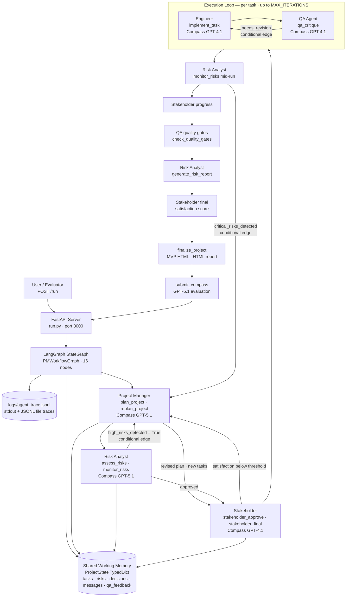

# Architecture

*Last updated: 2026-06-06 — reflects the system as delivered for AI Agenthon 2026 (Use Case ID: 1).*

---

## System Architecture — Mermaid Diagram



## High-level view (text)

```
Browser
  ↓  GET /
┌────────────────────────────────────────────────┐
│  Web UI  (frontend/dist — vanilla HTML/CSS/JS) │
│  • Dataset browser (20 telecom projects)        │
│  • Simulation form                              │
│  • Result panel: Open Report · Open MVP buttons │
└────────────────────────────────────────────────┘
  ↓  POST /run-sync   (or /run)
┌────────────────────────────────────────────────┐
│  FastAPI server  (run.py, port 8000)            │
│  • /dataset   /mvp/{id}   /report/{run_id}      │
│  • /project   /interactions   /status   /reset  │
└────────────────────────────────────────────────┘
  ↓  orchestrator.run_workflow()
┌────────────────────────────────────────────────┐
│  PMWorkflowGraph  (app/graph.py)                │
│  LangGraph StateGraph — compiled async graph    │
│  16 nodes · 4 conditional edges                │
└────────────────────────────────────────────────┘
  ↓  nodes call agents via await agent.method()
┌─────────┐  ┌──────────┐  ┌──────┐  ┌──────────────┐  ┌─────────────┐
│   PM    │  │ Engineer │  │  QA  │  │ Risk Analyst │  │ Stakeholder │
│GPT-5.1  │  │ GPT-4.1  │  │GPT-4.1│ │  GPT-5.1    │  │  GPT-4.1   │
└─────────┘  └──────────┘  └──────┘  └──────────────┘  └─────────────┘
  All agents read/write through SharedMemory (app/memory.py)
  All agents call the LLM via CompassClient (app/compass_integration.py)
  All agents log traces via trace_logger (logs/agent_trace.jsonl)
```

## Conditional Edges (the non-linear proof)

| Edge | Source node | Condition | Target node |
|---|---|---|---|
| 1 | `assess_risks` | `high_risks_detected == True` | `replan_project` |
| 2 | `qa_critique` | `qa_approved == False AND retry < MAX` | `engineer_revise` |
| 3 | `monitor_risks` | `critical_risks_detected == True` | `mid_replan` |
| 4 | `set_next_task` | `engineer_task_queue` non-empty | loop back to `implement_task` |

---

## LangGraph workflow — node by node

The workflow is a `langgraph.graph.StateGraph` compiled in `app/graph.py`. The state contract is `ProjectState` (`app/state.py`), a `TypedDict` that every node reads from and returns updates to.

```
START
  → plan_project
  → assess_risks
  → [conditional] replan_project   (only if high_risks_detected)
  → stakeholder_approve             (always; builds engineer task queue)
  → set_next_task                   (routing node — pops next task id)

  ┌── while engineer_task_queue is non-empty ──────────────────────┐
  │   → implement_task              Engineer writes source files     │
  │   → qa_critique                 QA critiques; sets qa_approved   │
  │   → [conditional] engineer_revise → qa_critique                 │
  │     (only if not approved AND qa_retry_count < MAX_QA_RETRIES)  │
  │   → monitor_risks               deterministic progress check     │
  │   → [conditional] mid_replan    (only if critical_risks_detected)│
  │   → set_next_task               (loop or exit)                   │
  └────────────────────────────────────────────────────────────────┘

  → stakeholder_progress
  → check_quality_gates
  → generate_risk_report
  → stakeholder_final
  → finalize_project               generates MVP HTML + collaboration summary
  → submit_compass                 submits metrics to Compass API
END
```

**Constants** (in `app/graph.py`):

| Constant | Value | Effect |
|---|---|---|
| `MAX_QA_RETRIES` | 1 | Engineer may revise each task at most once before QA passes it through |
| `MAX_ITERATIONS` | 3 | Maximum engineer tasks processed per run |

---

## State contract — ProjectState

Every node receives the full `ProjectState` dict and returns a partial dict of keys it updates. LangGraph merges the return value into the state before calling the next node.

Key state fields and who owns them:

| Field | Set by | Read by |
|---|---|---|
| `tasks` | `plan_project`, `replan_project`, `implement_task` | All nodes via `_state_to_project` |
| `risks` | `assess_risks`, `monitor_risks` | `replan_project`, `generate_risk_report`, `submit_compass` |
| `high_risks_detected` | `assess_risks` | Conditional edge: `assess_risks → replan_project` |
| `engineer_task_queue` | `stakeholder_approve` | `set_next_task` |
| `current_task_id` | `set_next_task` | `implement_task`, `qa_critique`, `engineer_revise` |
| `qa_approved` | `qa_critique` | Conditional edge: `qa_critique → engineer_revise` |
| `qa_retry_count` | `set_next_task` (reset), `engineer_revise` (increment) | Conditional edge threshold check |
| `critical_risks_detected` | `monitor_risks` | Conditional edge: `monitor_risks → mid_replan` |
| `mvp_path` | `finalize_project` | `run.py` → returned to caller |
| `compass_evaluation` | `submit_compass` | Final response |

---

## Shared memory

`SharedMemory` (`app/memory.py`) is the in-process world model. It is NOT persisted to disk; restarting the server clears all state.

```
SharedMemory
├── projects: Dict[str, Project]            # keyed by project_id
├── messages: List[Message]                 # all agent-to-agent messages
├── decisions: List[dict]                   # agent decisions with reasoning
├── feedback_loops: Dict[str, List[dict]]   # QA↔Engineer revision cycles
└── agent_summaries: Dict[str, str]         # "role:key" → JSON string blob
```

Agents write summaries with `memory.store_summary(role, key, json_blob)` and read them with `memory.get_summary(role, key)`. This is the primary mechanism for cross-agent context passing (e.g. QA reads the engineer's implementation summary before critiquing it).

---

## Agent LLM calls

Every agent calls `await self.llm_decide(system_prompt, user_message, max_tokens)` defined in `BaseAgent`. This:
1. Calls `compass_client.call_llm()` which uses the OpenAI SDK against the Core42 endpoint.
2. Strips markdown fences if the LLM returns them.
3. Parses the response as JSON.
4. Returns a plain dict; on parse failure returns `{"reasoning": raw_text, "confidence": 0.65}`.

Temperature is fixed at 0.3 across all calls to keep structured JSON output reliable.

**Deterministic operations (no LLM call):**

| Node / method | Why deterministic |
|---|---|
| `_run_monitoring` (Risk Analyst) | Checks progress % and critical-risk count against thresholds — fast, no latency |
| `_execute_tests` (QA) | Called only when QA has a standalone task (not the critique loop); always approves |
| `check_quality_gates` (QA) | Threshold arithmetic on accumulated test_reports list |

---

## MVP HTML generation

After `finalize_project`, the Engineer agent calls `generate_mvp_html(project)`:

1. Calls the LLM with `_MVP_SYSTEM` — a prompt instructing it to generate a complete self-contained HTML file (all CSS and JS inline, no CDN, dark theme, full CRUD, localStorage persistence).
2. Post-processes the response to unescape over-escaped `\n` / `\"` sequences that some LLM responses contain.
3. Writes the file to `output_examples/{project_id}/mvp.html`.
4. Returns the path; `run.py` then serves it at `GET /mvp/{project_id}`.

---

## Report generation

`report_generator.generate_report(result, project_name)` (`app/report_generator.py`):

- Builds a Mermaid sequence diagram from the `messages` list.
- Renders task cards from the PM's raw plan (acceptance criteria, deliverables, phases).
- Renders the risk register, decision timeline, and QA feedback loops.
- Writes a self-contained HTML file to `reports/report_{run_id}.html`.
- `run.py` serves it at `GET /report/{run_id}`.

---

## Dataset browser

`dataset/telecom_projects.json` — 20 projects across 10 telecom enabling-function departments. Served by `GET /dataset` (with optional `?department=` filter). The web UI loads this on startup and renders clickable project cards that auto-fill the simulation form.

---

## File structure (current)

```
multi_agent_pm/
├── run.py                      FastAPI server + CLI entry point
├── requirements.txt
├── .env                        API keys / model config
├── dataset/
│   └── telecom_projects.json   20 telecom domain projects
├── app/
│   ├── graph.py                LangGraph StateGraph
│   ├── orchestrator.py         Thin wrapper (API compat)
│   ├── state.py                ProjectState TypedDict
│   ├── base_agent.py           LLM calls, messaging, tracing
│   ├── project_manager.py      PM agent
│   ├── engineer.py             Engineer agent + MVP generation
│   ├── qa_agent.py             QA agent
│   ├── risk_analyst.py         Risk Analyst agent
│   ├── stakeholder.py          Stakeholder agent
│   ├── memory.py               SharedMemory
│   ├── data_types.py           AgentRole, Task, Project, Message
│   ├── compass_integration.py  Core42 LLM client
│   ├── report_generator.py     HTML report builder
│   ├── trace_logger.py         JSONL trace appender
│   └── logging_config.py
├── frontend/
│   └── dist/                   Static web UI (no build step needed)
│       ├── index.html
│       ├── app.js
│       └── styles.css
├── input_examples/             8 sample project JSON inputs
├── output_examples/            Matching execution output JSONs
│   └── {project_id}/
│       ├── mvp.html            Generated self-contained MVP
│       └── spa/                React source files written by Engineer
├── reports/                    HTML reports (report_{run_id}.html)
└── logs/
    └── agent_trace.jsonl       Structured trace log
```
